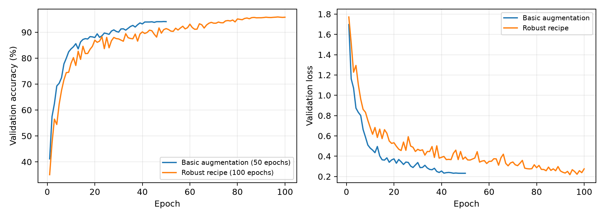

# CIFAR-specific ResNet-18: Experiment Report

## Objective

This project develops a robust CIFAR-10 classifier from basic PyTorch layers, without
pretrained weights or ready-made model architectures. A fixed seed-42 split provides
45,000 training images and 5,000 validation images. The 10,000-image test set is used
only after model selection.

## Model and optimization

The network is a CIFAR-specific ResNet-18 with a 3×3 stride-1 stem, four residual
stages, and global average pooling. It contains 11,173,962 parameters. The final
training recipe uses SGD (learning rate 0.1, momentum 0.9, Nesterov, weight decay
5e-4), cosine decay, batch size 256, and seed 2026.

Robust regularization combines random crops, horizontal flips, RandAugment, random
erasing, Mixup, and label smoothing. Checkpoints are selected solely by clean
validation accuracy. The 100-epoch run also uses a conservative early-stop rule:
minimum 80 epochs and patience 20 for improvements greater than 0.02 percentage
points. It ran all 100 epochs because useful improvements continued through epoch 97.

## Results

| Configuration | Best epoch | Validation | Test |
|---|---:|---:|---:|
| Five-layer CNN + batch normalization | 19/20 | 77.06% | 72.78% |
| ResNet-18 + crop/flip | 49/50 | 94.12% | 93.36% |
| Robust ResNet-18 | 59/60 | 95.32% | 94.79% |
| Robust ResNet-18, extended | **97/100** | **95.88%** | **95.66%** |

The 100-epoch schedule improves validation accuracy by 0.56 points and test accuracy
by 0.87 points over the 60-epoch run. This confirms that the longer cosine schedule
was still learning rather than merely fitting training noise.

## Robustness analysis

Two deterministic transformations of the held-out validation split provide simple
distribution-shift proxies. Gaussian noise has standard deviation 0.15 in normalized
space; central occlusion masks an 8×8 region. Neither proxy affects training or
checkpoint selection.

| Configuration | Clean | Gaussian noise | Central occlusion |
|---|---:|---:|---:|
| Crop/flip, 50 epochs | 94.12% | 44.64% | 79.90% |
| Robust recipe, 60 epochs | 95.32% | 67.40% | 88.50% |
| Robust recipe, 100 epochs | **95.88%** | **70.28%** | **89.48%** |

The robust recipe materially improves both corruptions without sacrificing clean
accuracy. Extending training adds another 2.88 points under noise and 0.98 points under
occlusion. These proxies do not cover every real distribution shift; a broader future
evaluation could use CIFAR-10-C and multiple random seeds. Additional augmentation
should be evaluated as a replacement ablation—such as AugMix versus RandAugment or
CutMix versus Mixup—rather than stacked without evidence.
